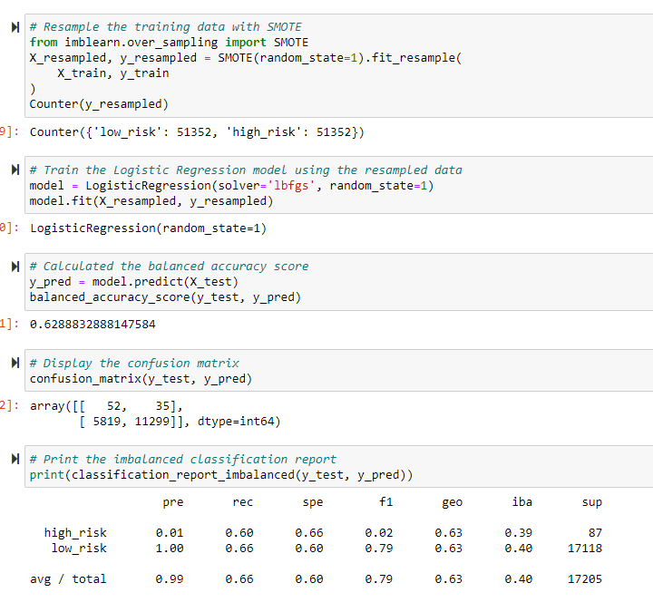
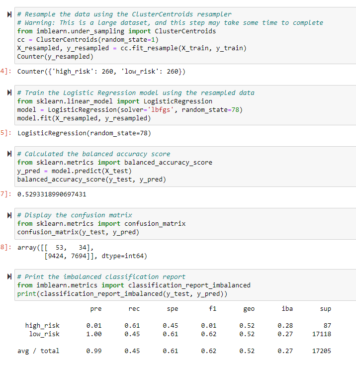
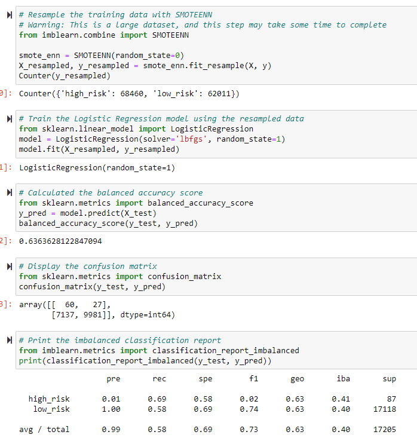
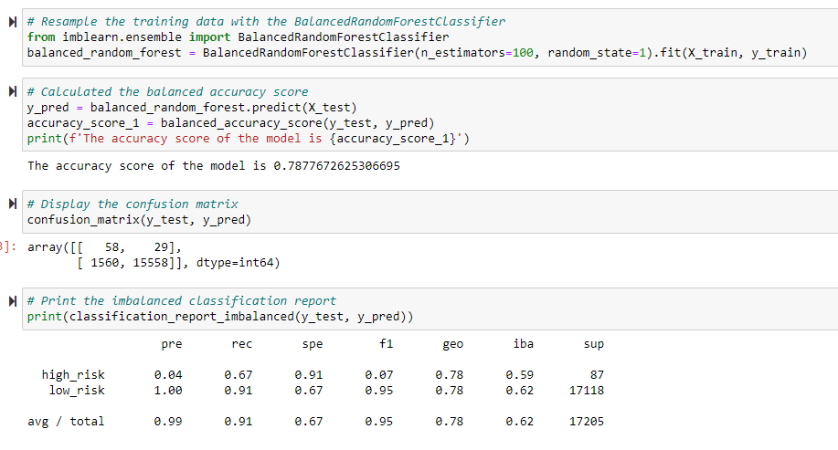
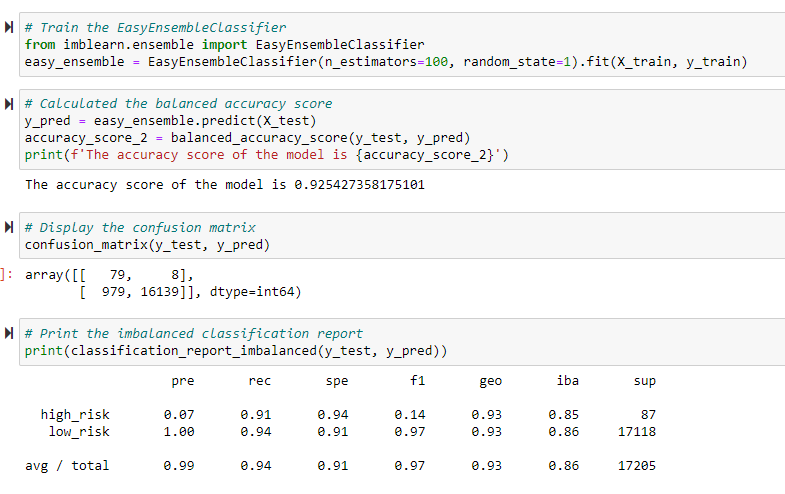

# Credit Risk Analysis
## Purpose
Jill needs our help with applying machine learning to solve credit card risk. I will be using Python to run six different machine learning models. First, I will use the RandomOverSampler and SMOTE algorithms to run two different oversampling models. Next, I will run the ClusterCentroids algorithm for a undersampling model. Then I will run the SMOTEENN algorithm for a combination model. Lastly, I will run and compare BalancedRandomForestClassifier and EasyEnsembleClassifier which will reduce bias. After, running all six different machine models I will analyze the results and make a recommendation on if they should be utilized to predict credit risk.
## Results
### Naive Random Oversampling
\
- The balanced accuracy score is 63%.
- The high_risk precision is 1% with a recall of 60%.
- The low_risk precision is about 100% with a recall of 66%. This is due to the large population of low_risk. 
### SMOTE Oversampling
\
- The balanced accuracy score is 63%.
- The high_risk precision is about 1% with a recall of 60%.
- The low_risk precision is about 100% with a recall of 66%. Again, this is due to the large population of low_risk.
### Undersampling
\
- The balanced accuracy score is 53%.
- The high_risk precision is about 1% with a recall of 61%.
- The low_risk precision is about 100% with a recall of 45%. This is due to the high numbers of false positives.
### Combination (Over and Under) Sampling
\
- The balanced accuracy is 64%.
- The high_risk precision is about 1% with a recall of 69%.
- The low_risk precision is about 100% with a recall of 58%. This is also due to the high number of false positives.
### Balanced Random Forest Classifier
\
- The balanced accuracy is 79%.
- The high_risk precision is about 4% with a recall of 67%.
- The low_risk precision is about 100% with a recall of 91%. This is due to the low number of false positives.
### Easy Ensemble AdaBoost Classifier
\
- The accuracy score of the model is 93%.
- The high_risk precision is about 7% with a recall of 91%.
- The low_risk precision is about 100% with a recall of 94%. This is also due to the low number of false positives.
## Summary
After running all six machine learning models, high risk credit has low precision across all models. This means all the models do not accurately predict if a credit risk is high. The Easy Ensemble model had the best numbers. The accuracy score is 93%. Also, the recall of high-risk credit is 91% and 94% for low risk credit. This means the model finds almost all high and low credit risks. However, we can see above that there are still quite a bit of low-risk credit being detected as high risk. This can cause banks to consider a business to be risky when they are not. Therefore, banks would pass a business off or not give them any loans. In conclusion, I would not recommend any of the models.
