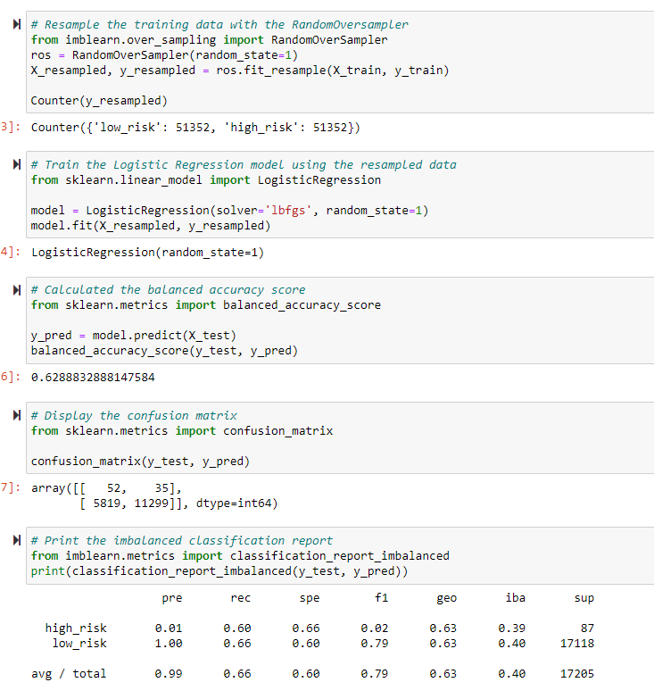

# Credit Risk Analysis
## Purpose
## Results
### Naive Random Oversampling

### SMOTE Oversampling

### Undersampling

### Combination Sampling
### Balanced Random Forest Classifier
### Easy Ensemble AdaBoost Classifier
## Summary
